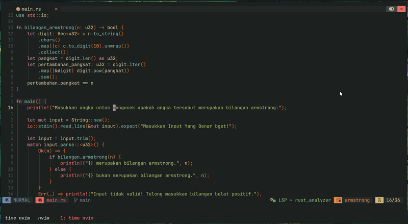
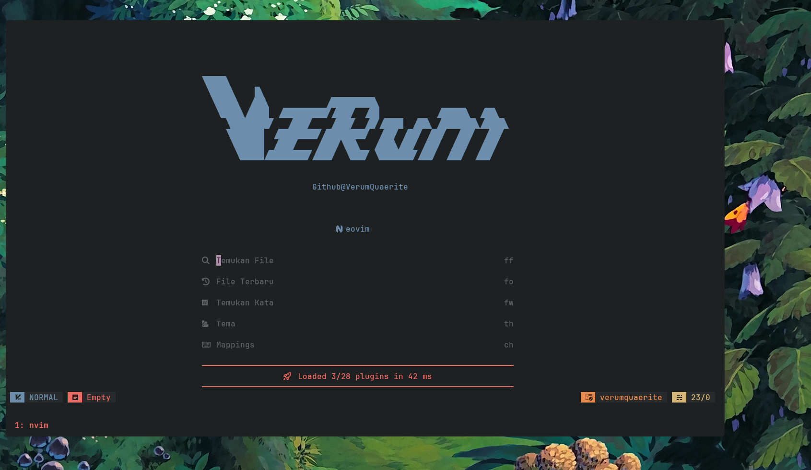
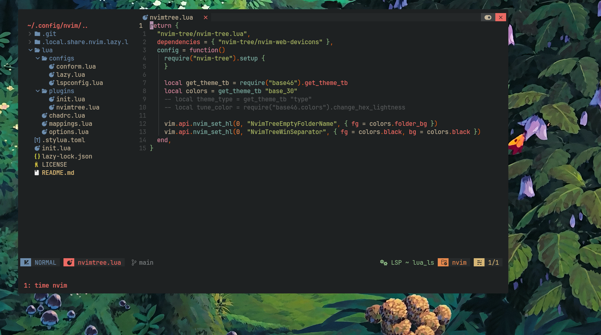

**This is my Nvim (With NvChad) config file. Feel free to clone it ^_^**

So, my NvChad config just broke all of a sudden. And i'm too lazy to fix it. So i'm currently trying out (or coming back tbf) to Lazyvim. So it's more likely that i will not update the "mappings for easy navigation" thing. But if someday i decided to come back to using NvChad, i will do it regardlessly.

# Features:

- Custom mappings (Will constantly update it for easy navigation)
- LSP configs 
- Overrides (Change the bg to your desired base46 theme)

# Added plugins:

- Hop.nvim by smoka7



# Installation:

- clone this repo
- run the install script

```Bash
chmod +x install.sh | ./install.sh
```

# Custom dashboard:




- Move the nvconfig.lua file into your ~/.local/share/nvim/lazy/ui/lua/ directory

# Clean background color for NvimTree.



# Reminder

**Do not forget to backup your existing neovim config. In case something go wrong and you want to go back.**

# Credits

1) Lazyvim starter https://github.com/LazyVim/starter as nvchad's starter was inspired by Lazyvim's . It made a lot of things easier!
